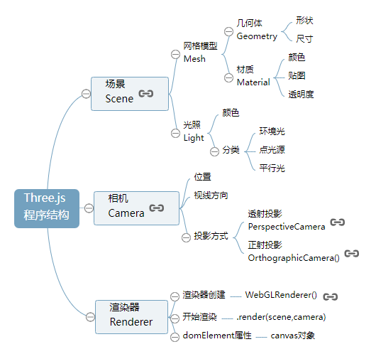

下面文件夹来自官方 https://github.com/mrdoob/three.js，用于学习之用。


```
/build/
/examples/
```

Three.js 中文文档：http://www.yanhuangxueyuan.com/threejs/docs/index.html

Three.js 零基础入门教程：http://www.yanhuangxueyuan.com/Three.js/




## 场景 Scene


## 网格模型 Mesh


## 光源 Light


## 相机 Camera


## 渲染器 Renderer


## 旋转、缩放、平移变换

+ .scale() 缩放
+ .translate() 平移
+ .rotateX() 绕X轴旋转
+ .rotateY() 绕Y轴旋转
+ .rotateZ() 绕Z轴旋转

```
// 请求再次执行渲染函数render
requestAnimationFrame(render);

// 创建一个立方体几何对象Geometry
var geometry = new THREE.BoxGeometry(100, 100, 100);

// 几何体xyz三个方向都放大2倍
geometry.scale(2, 2, 2);

// 几何体沿着x轴平移50
geometry.translate(50, 0, 0);

// 几何体绕着x轴旋转45度
geometry.rotateX(Math.PI / 4);

// 居中：偏移的几何体居中
geometry.center();

```


## skybox

六面顺序：right/left/up/down/front/back

右侧，左侧，上面，下面，前面，背面

```
const cubeTextureLoader = new THREE.CubeTextureLoader();
cubeTextureLoader.setPath( './img/' );
const cubeTexture = cubeTextureLoader.load( [
  'mobile_r.jpg', 'mobile_l.jpg',
  'mobile_u.jpg', 'mobile_d.jpg',
  'mobile_f.jpg', 'mobile_b.jpg'
] );
scene.background = cubeTexture;

```

